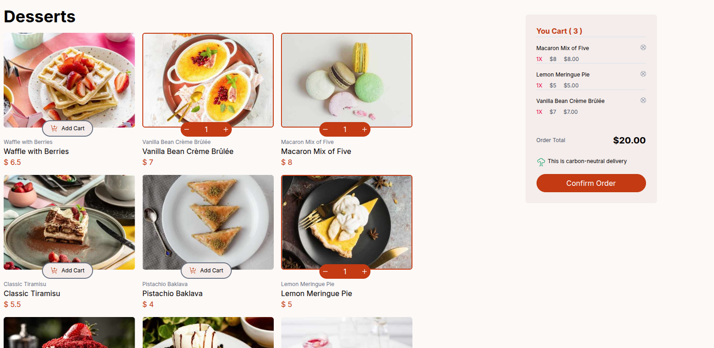

# Frontend Mentor - Product list with cart solution

This is a solution to the
[Product list with cart challenge on Frontend
Mentor](https://www.frontendmentor.io/challenges/product-list-with-cart-5MmqLVAp_d).
Frontend Mentor challenges help you improve your coding skills by
building realistic projects.

## Table of contents

- [Overview](#overview)
  - [The challenge](#the-challenge)
  - [Screenshot](#screenshot)
  - [Links](#links)
- [My process](#my-process)
  - [Built with](#built-with)
  - [What I learned](#what-i-learned)
  - [AI Collaboration](#ai-collaboration)
- [Author](#author)

## Overview

### The challenge

Users should be able to:

- Add items to the cart and remove them
- Increase/decrease the number of items in the cart
  -/home/john/proyectos/product-list-wiht-car/product-list-with-cart-main/AGENTS.md
  See an order confirmation modal when they click "Confirm Order"
- Reset their selections when they click "Start New Order"
- View the optimal layout for the interface depending on their device's screen size
- See hover and focus states for all interactive elements on the page

### Screenshot



### Links

- Solution URL: [Add solution URL here](https://github.com/johnb03/product-list-with-cart-main)
- Live Site URL: [Add live site URL here](https://your-solution-url.com)

## My process

### Built with

- Semantic HTML5 markup
- CSS custom properties
- Flexbox
- CSS Grid
- Mobile-first workflow
- [vuejs](https://vuejs.org/) - JS library
- [TailwindCSS](https://tailwindcss.com/) - For styles

### What I learned

Aca pusimos en practica a Vue.js un framework
de javasscript,
la creacion de componentes y las directivas vi- que facilitan el
uso practico de la aplicacion de codigo js.

```js
<div
      class="w-full flex flex-col md:flex-row md:col-span-2 md:flex-wrap gap-4 items-center"
      id="content-right"
    >
      <h2 class="text-4xl w-72 text-left font-bold md:w-full">Desserts</h2>
      <CardsProduct
        v-for="(item, index) in Products"
        :key="index"
        :product="item.category"
        :nameProduct="item.name"
        :price="item.price"
        :imageUrl="item.image"
      />
    </div>
```

### AI Collaboration

Estoy utilizando opencode como un mentor, no para creacion de codigo,
si no para que me corrija los errores utilizando las erramientras que estoy aprendiendo.

- zen , geemini
- para corregir solo errores y ayudar el aprendizage.

## Author

- Website - [Methodev](https://johnb03.github.io/portafolio-John-Berroa/)
- Frontend Mentor - [@johnb03](https://www.frontendmentor.io/profile/johnb03)
